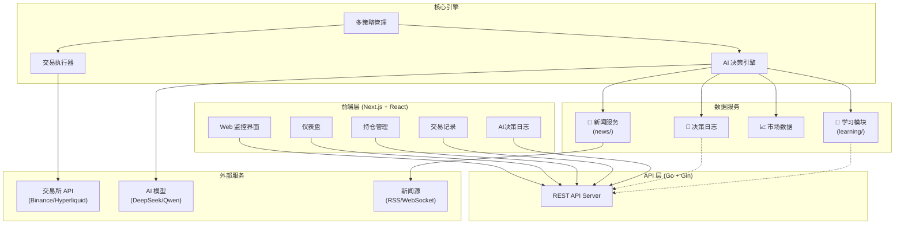
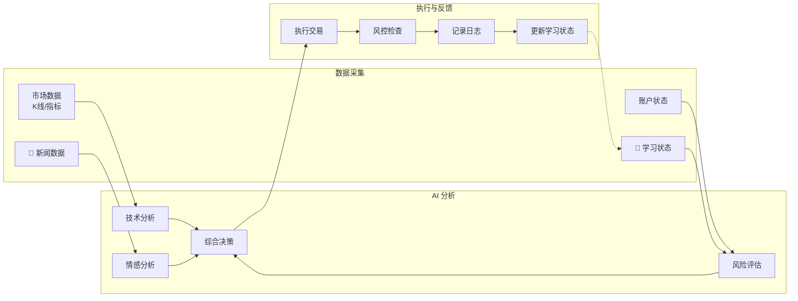

# 📊 基于AI大模型的量化交易系统

> **本科毕业设计 | 软件工程专业**

[](https://www.gnu.org/licenses/agpl-3.0)
[](https://golang.org/)
[](https://nextjs.org/)
[](https://www.deepseek.com/)

一个基于**大语言模型（LLM）**进行量化交易决策的智能系统。系统以市场基本面和技术面分析为核心，结合实时新闻情感作为辅助参考，通过 AI 大模型进行综合分析和交易决策。

---

## 📢 项目声明

本项目基于开源项目 [本系统](https://github.com/NoFxAiO./main) 进行二次开发，遵循 AGPLv3 开源协议。

**本项目已获得原作者同意用于学术研究和毕业设计。**

### 核心设计理念

```
┌─────────────────────────────────────────────────────────────┐
│                      AI 交易决策引擎                         │
├─────────────────────────────────────────────────────────────┤
│                                                             │
│   ┌──────────────┐  ┌──────────────┐  ┌──────────────┐     │
│   │  市场基本面   │  │  技术面分析   │  │  新闻辅助    │     │
│   │   (核心)     │  │   (核心)     │  │  (参考)      │     │
│   │             │  │             │  │             │     │
│   │ • K线数据   │  │ • RSI/MACD  │  │ • 情感分析   │     │
│   │ • 资金流向  │  │ • 布林带    │  │ • 事件解读   │     │
│   │ • 持仓变化  │  │ • 均线系统   │  │ • 市场情绪   │     │
│   └──────┬───────┘  └──────┬───────┘  └──────┬───────┘     │
│          │                 │                 │             │
│          └────────────┬────┴─────────────────┘             │
│                       ▼                                    │
│              ┌─────────────────┐                           │
│              │   AI 综合决策   │                           │
│              │  (DeepSeek/Qwen)│                           │
│              └────────┬────────┘                           │
│                       ▼                                    │
│              ┌─────────────────┐                           │
│              │  交易执行+风控  │                           │
│              └─────────────────┘                           │
└─────────────────────────────────────────────────────────────┘
```

### 核心创新点

| 创新点 | 说明 |
|--------|------|
| 🤖 **AI 大模型决策** | 利用 DeepSeek/Qwen 等大模型进行市场分析和交易决策 |
| 📈 **多维度市场分析** | 基本面 + 技术面 + 新闻面综合研判 |
| 🧠 **自适应学习** | 基于历史表现动态调整风险参数和交易策略 |
| 📰 **新闻辅助参考** | 实时新闻情感分析作为决策辅助信息 |

### 原创贡献

在本项目中，我主要完成了以下原创性工作：

| 模块 | 代码量 | 核心功能 |
|------|--------|----------|
| 📰 **新闻辅助模块** (`news/`) | ~1900行 | WebSocket+RSS双源新闻获取、AI摘要生成、情感分析 |
| 🧠 **自适应学习模块** (`learning/`) | ~400行 | 交易表现统计、动态风险参数调整、币种表现评估 |
| 🖥️ **前端监控系统** (`web/`) | ~10000行 | Next.js + TypeScript 完全重写，实时监控界面 |
| **原创代码总计** | **~12000行** | |

---

## 📋 项目简介

本系统是一个**基于 AI 大模型的量化交易系统**，核心决策流程：

```
市场数据 ──▶ 技术分析 ──▶ AI综合研判 ──▶ 交易决策 ──▶ 风险控制 ──▶ 执行反馈
    │           │            │
    │           │            └── 新闻情感作为辅助参考
    │           └── RSI、MACD、布林带等技术指标
    └── K线、资金流向、持仓数据
```

**新闻的作用**：作为市场情绪的辅助参考，帮助 AI 更好地理解市场环境，但**不作为主要交易信号**。

### 核心特性

- 🤖 **AI 大模型决策**：利用 DeepSeek/Qwen 进行综合市场分析
- 📈 **技术面分析**：RSI、MACD、布林带、均线系统等
- 📊 **基本面分析**：K线形态、资金流向、持仓变化
- 📰 **新闻辅助**：实时新闻情感分析作为决策参考
- 🧠 **自适应学习**：根据历史表现动态调整策略参数
- 🛡️ **风险控制**：止损止盈、杠杆限制、回撤保护
- 🖥️ **实时监控**：Web 界面展示净值曲线、持仓、AI决策过程

## 🏗️ 技术架构

### 系统架构图



### AI 决策流程图



### 后端技术栈

| 组件 | 技术选型 | 说明 |
|------|---------|------|
| 语言 | Go 1.25+ | 高性能并发处理 |
| Web 框架 | Gin | RESTful API 服务器 |
| 交易所 SDK | go-binance, go-hyperliquid | 多交易所统一接口 |
| 区块链 | go-ethereum | Hyperliquid 和 Aster 支持 |

### 前端技术栈

| 组件 | 技术选型 | 说明 |
|------|---------|------|
| 框架 | Next.js 16 + React 19 | 全栈 React 框架 |
| 语言 | TypeScript | 类型安全 |
| 样式 | Tailwind CSS 4 | 实用优先的 CSS 框架 |
| 数据获取 | SWR | 数据获取和缓存，支持自动刷新 |
| 状态管理 | Zustand | 轻量级状态管理 |
| 图表库 | Recharts | 数据可视化 |
| Markdown | react-markdown | AI 决策内容渲染 |

## 📦 项目结构

```
jiaoyibot/
├── main.go                    # 程序入口
├── config.json.example        # 配置文件模板
├── docker-compose.yml         # Docker Compose 配置
├── Dockerfile.backend         # 后端 Dockerfile
│
├── api/                       # API 服务器
│   └── server.go              # REST API 端点
│
├── config/                    # 配置管理
│   └── config.go              # 配置加载和验证
│
├── trader/                    # 交易核心
│   ├── auto_trader.go         # 自动交易主控制器
│   ├── binance_futures.go     # 币安合约接口
│   ├── hyperliquid_trader.go  # Hyperliquid 接口
│   ├── aster_trader.go        # Aster DEX 接口
│   └── interface.go           # 交易接口定义
│
├── manager/                   # 多交易员管理
│   └── trader_manager.go       # 交易员生命周期管理
│
├── decision/                  # 决策引擎
│   └── engine.go              # AI 决策流程和 Prompt 构建
│
├── market/                    # 市场数据
│   └── data.go                # K线数据和技术指标
│
├── pool/                      # 币种池
│   └── coin_pool.go           # 币种列表管理
│
├── logger/                    # 日志记录
│   └── decision_logger.go     # 决策日志和性能分析
│
├── mcp/                       # AI 通信
│   └── client.go              # AI API 客户端
│
└── web/                       # 前端应用
    ├── Dockerfile.frontend    # 前端 Dockerfile
    ├── src/
    │   ├── app/               # Next.js 应用路由
    │   ├── components/        # React 组件
    │   ├── lib/               # 工具库
    │   └── store/             # 状态管理
    └── package.json
```

## 🚀 快速开始

### 环境要求

- **Go 1.25+**
- **Node.js 18+**
- **TA-Lib**（技术指标计算库）

#### 安装 TA-Lib

**macOS:**
```bash
brew install ta-lib
```

**Ubuntu/Debian:**
```bash
sudo apt-get install libta-lib0-dev
```

**其他系统**: 参考 [TA-Lib 官方文档](https://github.com/markcheno/go-talib)

### 方式一：原生部署

#### 1. 克隆项目

```bash
git clone <repository-url>
cd jiaoyibot
```

#### 2. 安装依赖

**后端:**
```bash
go mod download
```

**前端:**
```bash
cd web
npm install
cd ..
```

#### 3. 配置系统

复制配置模板并编辑：

```bash
cp config.json.example config.json
nano config.json  # 或使用任何编辑器
```

**配置文件说明：**

```json
{
  "traders": [
    {
      "id": "my_trader",
      "name": "我的AI交易员",
      "enabled": true,
      "ai_model": "deepseek",          // "deepseek", "qwen", "custom"
      "exchange": "binance",            // "binance", "hyperliquid", "aster"
      "binance_api_key": "YOUR_KEY",
      "binance_secret_key": "YOUR_SECRET",
      "deepseek_key": "sk-xxxxxxxx",
      "initial_balance": 1000.0,
      "scan_interval_minutes": 3
    }
  ],
  "leverage": {
    "btc_eth_leverage": 5,
    "altcoin_leverage": 5
  },
  "use_default_coins": true,
  "default_coins": ["BTCUSDT", "ETHUSDT", "SOLUSDT"],
  "api_server_port": 8080
}
```

#### 4. 启动后端

```bash
# 编译
go build -o main

# 运行
./main
```

后端会在 `http://localhost:8080` 启动 API 服务。

#### 5. 启动前端

打开新的终端窗口：

```bash
cd web
npm run dev
```

前端会在 `http://localhost:3000` 启动。

### 方式二：Docker 部署（推荐）

使用 Docker Compose 一键启动前后端服务。

#### 1. 配置环境变量

创建 `.env` 文件（可选，用于覆盖默认配置）：

```bash
# 后端配置
NOF1_API_BASE_URL=http://localhost:8080
BACKEND_PORT=8080

# 前端配置
NEXT_PUBLIC_API_BASE_URL=http://localhost:8080
FRONTEND_PORT=3000
```

#### 2. 配置交易系统

编辑 `config.json` 文件（与原生部署相同）。

#### 3. 启动服务

```bash
docker-compose up -d
```

#### 4. 查看日志

```bash
# 查看所有服务日志
docker-compose logs -f

# 查看后端日志
docker-compose logs -f backend

# 查看前端日志
docker-compose logs -f frontend
```

#### 5. 停止服务

```bash
docker-compose down
```

详细 Docker 部署说明请参考 [DOCKER_DEPLOY.md](./DOCKER_DEPLOY.md)。

### 6. 访问监控界面

在浏览器中打开 `http://localhost:3000`，即可看到：

- 📊 **资产总览**：账户净值曲线
- 📈 **持仓情况**：当前持仓和未实现盈亏（包含详细的持仓信息：开仓价格、标记价格、强平价格、止盈止损、保证金模式等）
- 💰 **成交记录**：历史交易明细
- 🤖 **模型对话**：AI 决策的完整思考过程
- 📉 **AI学习与反思**：胜率统计、币种表现分析

## 🔧 使用 PM2 管理（推荐生产环境）

PM2 可以让服务在后台运行，自动重启，并支持开机自启。

### 安装 PM2

```bash
npm install -g pm2
```

### 启动服务

```bash
./pm2.sh start
```

### 其他命令

```bash
./pm2.sh status      # 查看状态
./pm2.sh logs        # 查看日志
./pm2.sh stop        # 停止服务
./pm2.sh restart     # 重启服务
./pm2.sh rebuild     # 重新编译后端并重启
```

详细说明请参考 `pm2.sh` 脚本。

## 💡 核心功能

### 1. 🤖 AI 大模型决策引擎（核心）

系统利用大语言模型进行**综合市场分析**，主要基于：

| 分析维度 | 权重 | 内容 |
|----------|------|------|
| **市场基本面** | 高 | K线数据、资金流向、持仓变化、成交量 |
| **技术面分析** | 高 | RSI、MACD、布林带、均线系统、K线形态 |
| **历史表现** | 中 | 胜率、盈亏比、币种表现、策略有效性 |
| **新闻情感** | 低 | 市场情绪、重大事件、行业动态（辅助参考） |

**AI 决策流程：**
```
市场数据 ──┬──▶ 技术指标计算 ──┐
           │                    │
           ├──▶ 资金流向分析 ──┼──▶ AI 综合研判 ──▶ 交易决策
           │                    │        ▲
           └──▶ 持仓数据分析 ──┘        │
                                        │
                        新闻情感 ────────┘
                        (辅助参考)
```

### 2. 📈 技术分析模块

传统量化指标 + AI 增强：

- **趋势指标**：MA、EMA、MACD、ADX
- **震荡指标**：RSI、KDJ、CCI、威廉指标
- **波动指标**：布林带、ATR、标准差
- **成交量指标**：OBV、VWAP、资金流向

### 3. 📰 新闻辅助模块

新闻作为**辅助参考信息**，帮助 AI 理解市场环境：

```
实时新闻 ──▶ AI摘要 ──▶ 情感分析 ──▶ 作为决策参考
    │           │           │
    │           │           └── 利好/利空/中性 + 置信度
    │           └── 提取核心信息
    └── WebSocket/RSS 获取
```

**新闻不直接触发交易**，而是作为 AI 综合分析的背景信息。

### 4. 🧠 自适应学习系统

系统根据历史交易表现**自动优化策略**：

| 表现 | 系统调整 |
|------|----------|
| 胜率 > 60%，盈亏比 > 1.3 | 放宽置信度阈值，适度增加仓位 |
| 胜率 < 40%，持续亏损 | 提高置信度阈值，降低仓位 |
| 某币种表现持续不佳 | 标记为 avoid，暂停交易 |
| 某币种表现优异 | 标记为 focus，优先考虑 |

### 5. 🛡️ 风险控制体系

多层次风险保护机制：

```
                    ┌─────────────────┐
                    │   AI 交易信号   │
                    └────────┬────────┘
                             │
              ┌──────────────┼──────────────┐
              ▼              ▼              ▼
        ┌──────────┐  ┌──────────┐  ┌──────────┐
        │ 杠杆限制  │  │ 仓位管理  │  │ 止损止盈  │
        │ BTC≤5x   │  │ 最多3仓   │  │ 自动设置  │
        │ 山寨≤5x  │  │ 保证金≤90%│  │ 比例≥1:3 │
        └──────────┘  └──────────┘  └──────────┘
                             │
                    ┌────────┴────────┐
                    ▼                 ▼
              ┌──────────┐      ┌──────────┐
              │ 日亏损限制│      │ 回撤保护  │
              └──────────┘      └──────────┘
```

### 6. 🖥️ 实时监控界面

Web 界面提供完整的系统监控：

- 📈 **净值曲线**：多模型对比，时间范围可调
- 💰 **持仓详情**：开仓价、标记价、强平价、止盈止损
- 📰 **新闻面板**：实时新闻 + AI 摘要 + 情感分析
- 🤖 **AI 决策日志**：完整的思考过程和决策依据
- 📊 **性能统计**：胜率、盈亏比、夏普比率

## 📊 API 接口

后端提供以下 REST API 端点：

| 端点 | 说明 |
|------|------|
| `GET /health` | 健康检查 |
| `GET /api/competition` | 多策略总览 |
| `GET /api/account` | 账户信息 |
| `GET /api/positions` | 持仓列表（包含详细持仓信息） |
| `GET /api/trades` | 成交记录 |
| `GET /api/decisions` | 决策日志 |
| `GET /api/performance` | 性能统计 |
| `GET /api/equity-history` | 净值历史 |
| `GET /api/status` | 交易员状态 |
| `GET /api/statistics` | 统计数据 |

详细 API 文档请参考代码中的 `api/server.go`。

## 🔐 安全提示

⚠️ **重要安全提示**：

1. **API 密钥安全**：
   - `config.json` 包含敏感信息，已被 `.gitignore` 忽略
   - 不要将真实的 API 密钥提交到 Git 仓库
   - 建议使用交易所的子账户 API，限制权限为仅合约交易

2. **资金安全**：
   - 建议使用小额资金进行测试
   - 设置合理的止损和日亏损限制
   - 定期检查账户状态和交易记录

3. **网络安全**：
   - API 服务器默认仅监听本地（`localhost:8080`）
   - 如需外网访问，请配置反向代理（如 Nginx）并启用 HTTPS

## 🛠️ 开发指南

### 修改配置

修改 `config.json` 后需要重启后端服务。

### 查看日志

后端日志：
- 标准输出：实时显示交易决策和状态
- 文件日志：`logs/backend-out.log` 和 `logs/backend-error.log`

决策日志：
- JSON 格式存储在 `decision_logs/<trader_id>/` 目录

### 调试技巧

1. **测试配置**：使用 `config.mock.json` 进行测试（不进行真实交易）
2. **单交易员模式**：只启用一个交易员进行调试
3. **增加扫描间隔**：将 `scan_interval_minutes` 调大，减少决策频率
4. **查看决策日志**：检查 `decision_logs/` 目录中的 JSON 文件

## 📈 性能优化

### 后端优化

- 使用连接池复用交易所 API 连接
- 批量获取市场数据，减少 API 调用
- 缓存技术指标计算结果

### 前端优化

- SWR 自动缓存和重新验证
- 代码分割和懒加载
- 虚拟滚动（大数据列表）
- 10秒自动刷新机制，确保数据实时性

## ❓ 常见问题

### 币安持仓模式错误 (code=-4061)

**错误信息**：`Order's position side does not match user's setting`

**原因**：系统需要使用双向持仓模式，但您的币安账户设置为单向持仓。

**解决方法**：

1. 登录币安合约交易平台
2. 点击右上角的 ⚙️ 偏好设置
3. 选择 **持仓模式**
4. 切换为 **双向持仓 (Hedge Mode)**
5. 确认切换

> ⚠️ **注意**：切换前必须先平掉所有持仓。

## 🤝 贡献指南

欢迎提交 Issue 和 Pull Request！

## 📄 许可证

MIT License

---

## 🙏 致谢

### 开源项目致谢

本项目基于以下开源项目进行二次开发：

| 项目 | 作者 | 贡献 |
|------|------|------|
| **[本系统](https://github.com/NoFxAiO./main)** | [@Web3Tinkle](https://x.com/Web3Tinkle) | 核心交易引擎、多交易所支持、AI通信框架 |

上述项目采用 **AGPLv3** 开源协议，允许自由使用、修改和分发。

特别感谢原作者对本项目用于**学术研究和毕业设计**的支持与认可。

---

## 📚 毕业设计信息

- **课题名称**：基于AI大模型的量化交易系统
- **专业**：软件工程
- **学位**：本科

### 研究内容

1. 设计并实现基于大语言模型的量化交易决策引擎
2. 研究市场基本面与技术面的多维度分析方法
3. 构建新闻情感分析模块作为决策辅助参考
4. 实现自适应学习机制，动态优化交易参数

### 创新点

1. **AI 驱动的综合决策**：利用大模型进行市场基本面和技术面的综合分析
2. **多维度信息融合**：市场数据 + 技术指标 + 新闻情感的综合研判
3. **自适应风险控制**：基于历史表现的动态参数调整
4. **新闻辅助分析**：将新闻情感作为市场环境的辅助参考

---

**让 AI 分析市场，让数据驱动决策** 🚀
